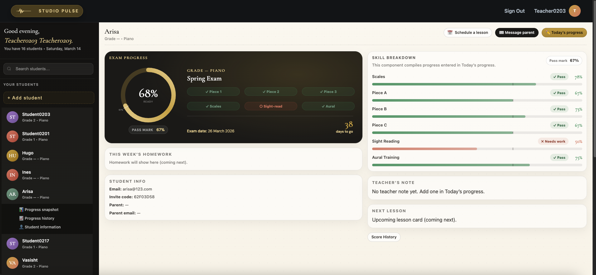
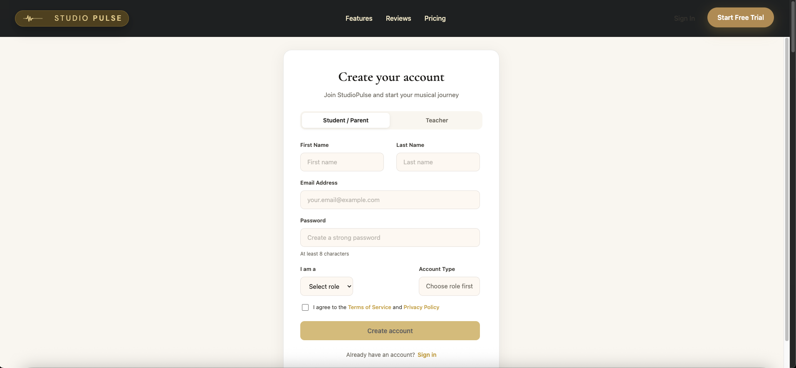
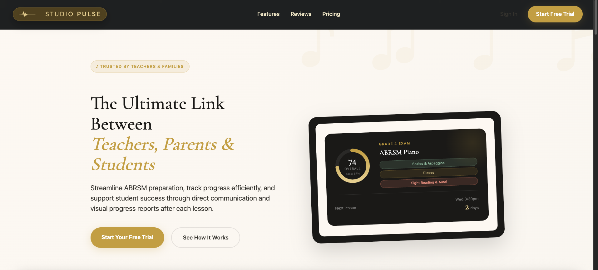

# StudioPulse Frontend (SP-react)

React frontend for **StudioPulse** — an ABRSM exam preparation platform that gives music teachers, students, and parents a shared, live view of exam readiness after every lesson.

🔗 **Live application:** https://studiopulse.co  
🔗 **Backend API:** https://api.studiopulse.co

---

## Product vision

StudioPulse replaces handwritten mark sheets, spreadsheets, and WhatsApp threads with a structured, data-driven preparation platform.

The core concept is the **Triangle of Success**: teacher, student, and parent all share a single live readiness snapshot — updated after every lesson, expressed in the language most useful to each role. No information asymmetry, no chasing, no surprises on exam day.

**Readiness target:** 67% = ABRSM pass mark. All progress indicators are relative to this threshold.

---

## Platform roadmap

| Phase | Status        | Scope                                                                     |
| ----- | ------------- | ------------------------------------------------------------------------- |
| 1     | **Live**      | Three dashboards — teacher, parent, student                               |
| 2     | Next release  | School manager layer — principal/director analytics above teacher         |
| 3     | Future        | StudioPulse Marketplace — teacher discovery by verified exam pass rate    |
| 4     | Future vision | AI + MIDI evaluation — digital keyboard input → objective readiness score |

### Phase 1 — Three dashboards (current)

**Teacher dashboard**

- Exam cycle creation and management (grade, type, target date, pass mark)
- Per-lesson grading against structured ABRSM criteria
- Live readiness % vs 67% ABRSM pass mark
- Lesson time suggestion — allocates minutes across pieces / scales / sight-reading / aural based on weakest areas and weeks remaining
- Homework assignment and schedule view

**Parent dashboard**

- Lesson summaries — what was covered, how the student performed
- Progress reports — readiness score and skill breakdown over time
- Homework visibility and exam countdown
- Teacher notes — guidance on supporting practice at home

**Student dashboard**

- Personal readiness score and skill heatmap
- This week's homework — tasks, practice goals, time targets
- Exam countdown, piece tracker, and lesson notes from each session

### Phase 2 — School manager (next)

A school account above the teacher layer. Principals and studio directors can evaluate teacher effectiveness, identify CPD needs, and view cohort-level readiness at a glance.

### Phase 3 — Marketplace (future)

A sister web service for teacher discovery — ranked by verified exam pass rates drawn directly from platform data. Only parents of active students can leave reviews.

### Phase 4 — AI + MIDI (future vision)

MIDI input from digital keyboards feeds a performance model trained on ABRSM criteria and accumulated student outcome data. Produces an independent readiness score alongside the teacher's assessment. The dataset built in Phase 1 is the defensibility moat.

---

## Screenshots





---

## Tech stack

**Frontend**

- React + Vite
- React Router
- CSS Modules
- Framer Motion

**Backend** (separate repository — SP-express)

- Node.js + Express 5
- MongoDB + Mongoose
- JWT in HTTP-only cookies

---

## Design system

| Token      | Value                |
| ---------- | -------------------- |
| `--cream`  | `#FAF7F2`            |
| `--gold`   | `#C9A84C`            |
| `--ink`    | `#1C1A17`            |
| `--rose`   | `#D4806A`            |
| `--sage`   | `#7A9E87`            |
| `--border` | `rgba(28,26,23,0.1)` |

Fonts: **Cormorant Garamond** (headings) + **DM Sans** (body)

Phase colour coding (roadmap UI):

| Phase              | Colour           |
| ------------------ | ---------------- |
| 1 — current        | Purple `#7F77DD` |
| 2 — school manager | Teal `#1D9E75`   |
| 3 — marketplace    | Amber `#BA7517`  |
| 4 — AI + MIDI      | Coral `#D85A30`  |

---

## Project structure

```
src
├── components
├── pages
├── contexts
├── services
├── utils
└── assets
```

The frontend communicates with SP-express through REST APIs.
All fetch calls use `credentials: 'include'` for cookie-based auth.

---

## Key patterns

- `useAuth()` — manages session state from `GET /api/auth/me`
- `credentials: 'include'` on every fetch call
- `location.state` for modal-intent navigation
- BARE_ROUTES — suppresses header/footer for standalone pages
- Error boundary — all API calls wrapped in try/catch, toast on failure
- WizardPanel — shared step-indicator component (gold = active, sage = done)

---

## Critical enum mapping (wizard → backend)

```
"ABRSM - Performance" → "Performance"
"ABRSM - Practical"   → "Practical"
Grade level (string)  → examGrade (integer)
```

---

## Local development

```bash
npm install
npm run dev
```

Default URL: `http://localhost:3000`

The frontend expects the backend running locally on `http://localhost:4000` or at `https://api.studiopulse.co`.

---

## Production deployment

```bash
npm run build
sudo rm -rf /var/www/studiopulse.co/*
sudo cp -r dist/* /var/www/studiopulse.co/
sudo systemctl reload nginx
```

Frontend is served via **Nginx** on an Ubuntu VM on GCP.

---

## Related repository

**SP-express** — Node.js/Express backend API  
https://github.com/FaridaNelson/SP-express

---

## Contributors

**Farida Nelson**  
Full-Stack Development, Backend Architecture, API Design, User Experience Strategy, System Integration, Product Logic

**Dilara Swain**  
UX/UI Design, User Experience Strategy, Workflow Design, Product Logic

---

## Author

Farida Nelson  
Software Engineer | Founder – StudioPulse  
https://linkedin.com/in/farida-nelson  
https://studiopulse.co
